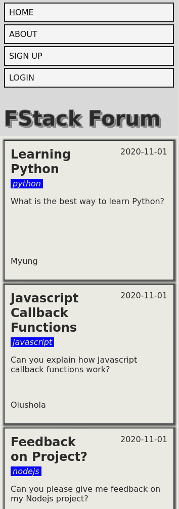
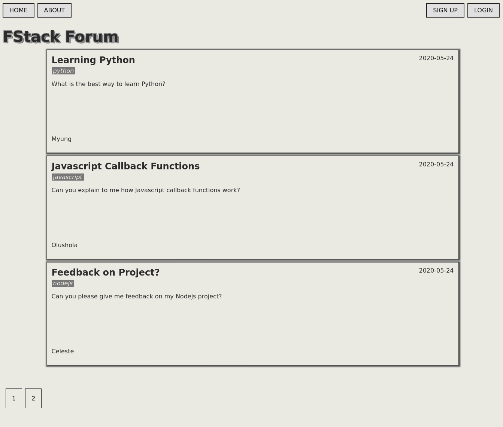
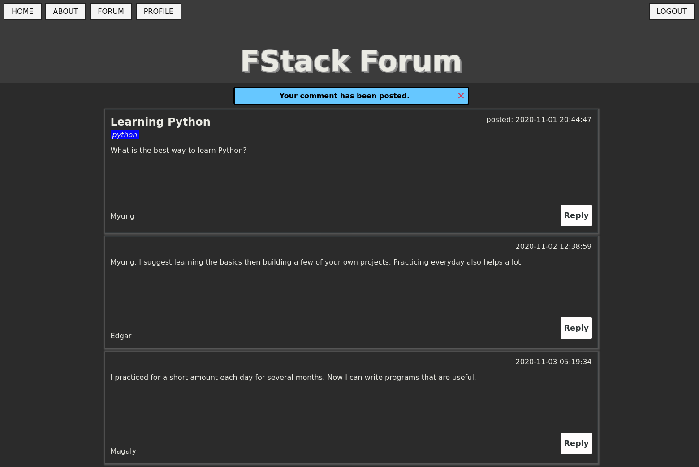

# FStack Forum

# A Forum built with Python, Flask, Flask Blueprints, Flask-SQLAlchemy, and Postgresql.

# Screenshots





```
├── application/
│   ├── admin/
│   │   ├── __init__.py
│   │   └── routes.py
│   ├── auth/
│   │   ├── __init__.py
│   │   └── routes.py
│   ├── forum/
│   │   ├── __init__.py
│   │   └── routes.py
│   ├── static/
│   │   ├── css/
│   │   │   ├── all.css
│   │   │   └── style.css
│   │   ├── images/
│   │   │   ├── default.png
│   │   │   ├── favicon.png
│   │   │   ├── screenshot1.png
│   │   │   ├── screenshot2.png
│   │   │   └── screenshot3_dark.png
│   │   ├── js/
│   │   │   └── script.js
│   │   └── webfonts/
│   │       ├── fa-brands-400.eot
│   │       ├── fa-brands-400.svg
│   │       ├── fa-brands-400.ttf
│   │       ├── fa-brands-400.woff
│   │       ├── fa-brands-400.woff2
│   │       ├── fa-regular-400.eot
│   │       ├── fa-regular-400.svg
│   │       ├── fa-regular-400.ttf
│   │       ├── fa-regular-400.woff
│   │       ├── fa-regular-400.woff2
│   │       ├── fa-solid-900.eot
│   │       ├── fa-solid-900.svg
│   │       ├── fa-solid-900.ttf
│   │       ├── fa-solid-900.woff
│   │       └── fa-solid-900.woff2
│   ├── templates/
│   │   ├── admin/
│   │   │   ├── dashboard.html
│   │   │   ├── login.html
│   │   │   ├── preferences.html
│   │   │   └── profile.html
│   │   ├── auth/
│   │   │   ├── login.html
│   │   │   ├── logout.html
│   │   │   ├── preferences.html
│   │   │   ├── profile.html
│   │   │   ├── request_reset_password.html
│   │   │   ├── reset_password_token.html
│   │   │   └── signup.html
│   │   ├── forum/
│   │   │   ├── about.html
│   │   │   ├── create_post.html
│   │   │   ├── feedback.html
│   │   │   ├── forum.html
│   │   │   ├── general.html
│   │   │   ├── help.html
│   │   │   ├── html-css.html
│   │   │   ├── index.html
│   │   │   ├── javascript.html
│   │   │   ├── nodejs.html
│   │   │   ├── post.html
│   │   │   ├── python.html
│   │   │   └── support.html
│   │   ├── 403.html
│   │   ├── 404.html
│   │   ├── 500.html
│   │   ├── layout.html
│   │   └── macros.html
│   ├── forms.py
│   ├── __init__.py
│   ├── models.py
│   ├── Pipfile
│   └── Pipfile.lock
├── cli.py
├── LICENSE
├── Pipfile
├── Pipfile.lock
├── Procfile
├── readme.md
├── requirements.txt
├── run.py
└── runtime.txt
```

# Quick Start

1) Clone repository.
```
$ git clone git@github.com:brandon-wallace/fstack-forum.git
$ cd fstack-forum/
```

2) Create a .env file. Add the following settings:
```
$ vim .env

FLASK_ENV=development
FLASK_APP=run.py
DATABASE_URL='postgres://<username>:<password>@<hostname>:<port>/<database_name>'
SECRET_KEY=<your_secret_key>
MAIL_SERVER=<your_email_server>
MAIL_USERNAME=<your_username>
MAIL_PASSWORD=<your_password>
MAIL_DEFAULT_SENDER=<your_default_email_address>
```

3) Initialize and activate virtual environment.
```
$ pipenv shell
```

4) Install dependencies.
```
$ pipenv install
```

5) Create database.
```
$ psql

# CREATE DATABASE fstackforum.db

# \q
```

6) Create tables.
```
$ python3 cli.py initdb

```

7) Start the development server.
```
$ flask run -h 127.0.0.1 -p 5000
```

8) Navigate to [http://127.0.0.1:5000](http://127.0.0.1:5000)


Reset database.
```
# Delete tables.
$ python3 cli.py dropdb

# Create tables.
$ python3 cli.py initdb

```

# License

This project is licensed under the GPL-3.0 License.
