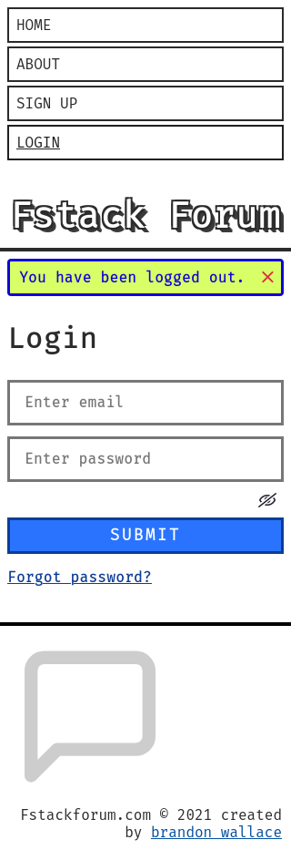
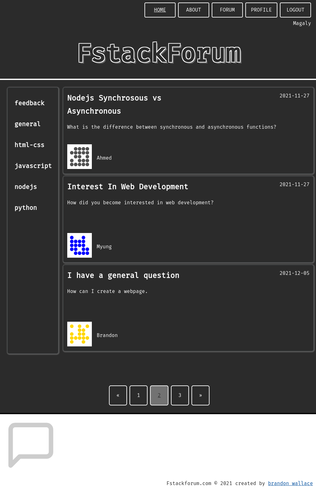

# FStack Forum

# A Forum built with Python, Flask, Flask Blueprints, Flask-SQLAlchemy, and Postgresql.

# https://fstackforum.com/

# Screenshots







# Installation

## Clone repository.

```
$ git clone git@github.com:brandon-wallace/fstack-forum.git

$ cd fstack-forum/
```

## Create a .env file. Add the following environmental variables:

```
$ vim .env

FLASK_ENV=development
FLASK_APP=run.py
DATABASE_URI='postgresql://<username>:<password>@<hostname>:<port>/<database_name>'
DEV_DATABASE_URI='sqlite://<database_file>'
SECRET_KEY=<your_secret_key>
SECURITY_PASSWORD_SALT=<your_password_salt>
```

To connect to a local SMTP server add this to the .env file.

```
MAIL_SERVER='localhost'
MAIL_PORT=25
MAIL_USERNAME=""
MAIL_PASSWORD=""
MAIL_DEFAULT_SENDER="no-reply@<yourdomain.com>"
```

To use Gmail as an SMTP server add this to the .env file.

```
MAIL_SERVER='smtp@gmail.com'
MAIL_PORT=465
MAIL_USERNAME="<your_gmail_username@gmail.com>"
MAIL_PASSWORD="<your_gmail_password>"
MAIL_DEFAULT_SENDER=("<Your gmail username>", "<your_gmail_username@gmail.com>")
```

## Initialize and activate virtual environment.

```
$ pipenv shell
```

## Install dependencies.

```
$ pipenv install

$ pipenv install flask-debugtoolbar --dev
```

## Install PostgreSQL

[Install PostgreSQL](https://www.postgresql.org/download/)

# Create a database.

```
$ psql

# CREATE DATABASE fstackforum.db

# \q
```

## Create tables in the database.

```
$ python3 

>>> from application import create_app

>>> app = create_app()

>>> app.app_context().push()

>>> exit()
```

## Start the development server.

```
$ flask run -h 127.0.0.1 -p 5000
```

## Navigate to [http://127.0.0.1:5000](http://127.0.0.1:5000)

# Run application as a service.

## Create a systemd service to run application.

```
$ vim /etc/systemd/system/fstackforum.service 

[Unit]
Description=Use Guicorn to run fstackforum.
After=network.target

[Service]
User=<your_username>
Group=<group_name> 
WorkingDirectory=/path/to/fstackforum
ExecStart=/path/to/gunicorn --workers 3 --bind unix:/path/to/fstackforum/fstackforum.sock wsgi:app 

[Install]
WantedBy=multi-user.target
```
Start the service.

```
$ sudo systemctl enable fstackforum.service

$ sudo systemctl start fstackforum.service
```

# Troubleshooting

Add logging to Gunicorn. 
Change the systemd file from this.

```
ExecStart=/path/to/gunicorn --workers 3 --bind unix:/path/to/fstackforum/fstackforum.sock wsgi:app 

```
To this:

```
ExecStart=/path/to/gunicorn --workers 3 --bind unix:/path/to/fstackforum/fstackforum.sock wsgi:app --error-logfile /path/to/fstackforum/gunicorn-error.log --log-level debug

```

Check the systemd service.

```
$ sudo systemctl status fstackforum.service

$ journal -xe
```

## License

This project is licensed under the GPL-3.0 License.
